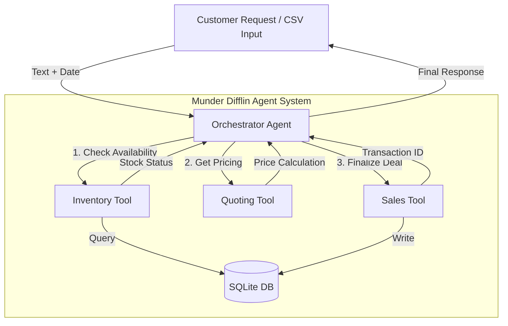

# 📎 Munder Difflin: AI Multi-Agent Supply Chain System

**An autonomous multi-agent system designed to streamline inventory management, dynamic quoting, and sales processing using LLMs.**


## 📖 Overview

This project implements a robust **Multi-Agent System (MAS)** for "Munder Difflin," a fictional paper manufacturing company. The system utilizes a **Centralized Orchestrator** architecture to interpret natural language customer requests, coordinate specialized agents, and execute business transactions in real-time without human intervention.

It handles complex scenarios such as:
- **Inventory Logic:** Checking stock across multiple SKUs and calculating dynamic delivery dates based on logistics rules.
- **Dynamic Quoting:** Using **RAG (Retrieval-Augmented Generation)** to search historical data for bulk discount precedents.
- **Sales Execution:** Writing final sales to the financial database and updating cash flow.

## ⚙️ Architecture

The system is built using the **`smolagents`** library (by Hugging Face) and follows a modular design managed by a main Orchestrator.

### Agent Workflow

1.  **Orchestrator Agent:** The "brain" of the operation. It receives the user's prompt and the current date, planning the execution flow (Check Inventory → Quote → Sell).
2.  **Inventory Tool:** Connects to SQLite to verify stock levels (`check_stock`) and estimates delivery dates (`get_delivery_estimate`) if items are out of stock.
3.  **Quoting Tool:** Retrieves base prices and uses RAG to scan `quotes.csv` for historical pricing strategies (`search_quote_history`).
4.  **Sales Tool:** The only component authorized to write to the `transactions` table (`create_transaction`), ensuring financial integrity.


🛠️ Tech Stack & Key Features
  - Language: Python
  - Orchestration: smolagents (Hugging Face)
  - LLM Backend: OpenAI GPT-4-turbo (via API proxy)
  - Data persistence: SQLite & Pandas

Engineering Challenge Solved:

Implemented a custom AgentTool Wrapper Class to bridge compatibility issues between specific versions of the agent framework. This wrapper allows the Orchestrator to treat sub-agents as stateless tools, injecting system instructions dynamically at runtime to maintain persona consistency.

📊 Results
  - The system was evaluated against a dataset of simulated customer requests. It demonstrated the ability to:
  - Process High-Value Transactions: Successfully negotiated and recorded sales totaling over $12,000 in simulated revenue.
  - Context Awareness: Correctly rejected orders (e.g., Request #4) where the calculated restocking date (Jan 2026) exceeded the customer's deadline (April 2025).
  - Inventory Tracking: Detected partial stock availability (e.g., Request #2: Poster paper available, but balloons out of stock) and communicated this clearly to the user.

📂 Project Structure
```
├── project_starter.py       # Main entry point and agent logic
├── munder_difflin.db        # SQLite database (generated on run)
├── quote_requests_sample.csv # Test input data
├── quotes.csv               # Historical data for RAG
├── requirements.txt         # Python dependencies
└── README.md                # Documentation

```
🔮 Future Improvements
  - Automated Procurement: Implement a "Restock Agent" that automatically places stock_orders when the Inventory Tool reports levels below the min_stock_level.
  - Negotiation Layer: Add a "Customer Persona" agent to simulate realistic price negotiations before the sale is finalized.
    
Developed by Octavio Alvarez
